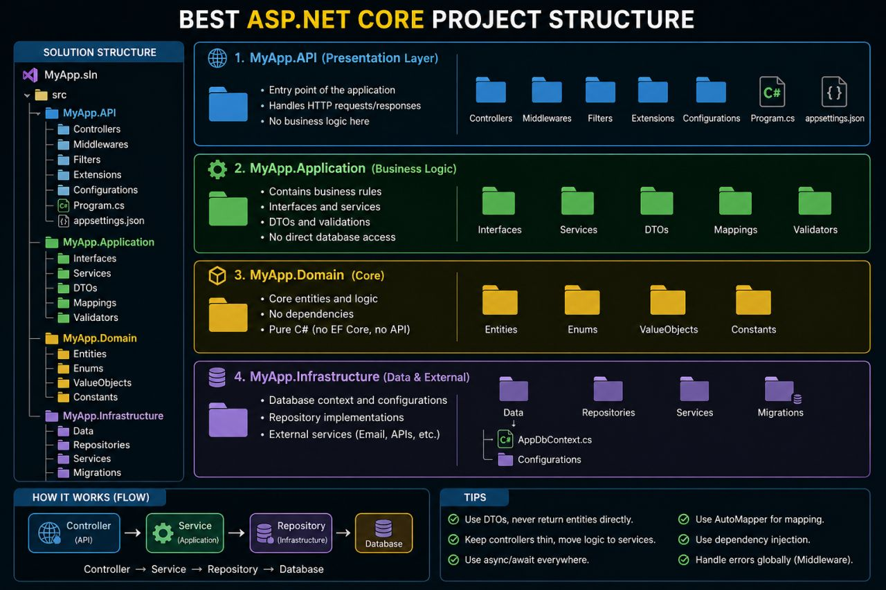

# CleanArchitecture (.NET 10)

This project is a practical example of **Clean Architecture** with **SOLID principles** in ASP.NET Core.

## Reference architecture image

> Place the provided reference image at `docs/images/clean-architecture-reference.png` so it renders correctly on GitHub.

## Why we use Clean Architecture

As applications grow, code can become tightly coupled, hard to test, and expensive to maintain. Clean Architecture helps avoid that by organizing the solution into clear layers with explicit responsibilities.

### Main goals

- Keep business rules independent from frameworks and infrastructure.
- Reduce coupling between UI, application logic, and data access.
- Make the codebase easier to test, extend, and maintain over time.

### Layered structure in this solution

- **CleanArchitecture.API** (Presentation)
  - Handles HTTP requests/responses.
  - Configures DI, middleware, and Swagger.
  - Does not contain business rules.

- **CleanArchitecture.Application** (Use cases)
  - Contains use-case orchestration and contracts.
  - Defines interfaces, DTOs, mappings, and validation.

- **CleanArchitecture.Domain** (Core)
  - Contains entities and business concepts.
  - Has no dependency on external layers.

- **CleanArchitecture.Infrastructure** (External concerns)
  - Implements repositories and technical services.
  - Depends on Application/Domain contracts.

### Dependency direction

Dependencies point inward toward the core business logic:

- `API -> Application + Infrastructure`
- `Infrastructure -> Application + Domain`
- `Application -> Domain`
- `Domain -> (no project references)`

This keeps the core stable even when frameworks or persistence details change.

## Why we use SOLID principles

SOLID gives design rules that improve maintainability and flexibility.

### S — Single Responsibility Principle
Each class should have one reason to change.

- `ProductsController` handles HTTP behavior.
- `ProductQueryService` handles read use cases.
- `ProductCommandService` handles write use cases.
- `ProductMapper` handles DTO/entity mapping.
- `ProductValidator` handles validation.

### O — Open/Closed Principle
Software should be open for extension, closed for modification.

- Interfaces allow adding new repository implementations (e.g., SQL, NoSQL) without changing controllers.

### L — Liskov Substitution Principle
Implementations should be replaceable through their abstractions.

- `IProductReadRepository` and `IProductWriteRepository` can be replaced by different infrastructure implementations while preserving behavior.

### I — Interface Segregation Principle
Clients should not depend on methods they do not use.

- Read and write contracts are separated:
  - `IProductQueryService` / `IProductCommandService`
  - `IProductReadRepository` / `IProductWriteRepository`

### D — Dependency Inversion Principle
High-level modules depend on abstractions, not concrete details.

- Controllers depend on service interfaces.
- Services depend on repository interfaces.
- Infrastructure provides concrete implementations through DI.

## Current example

This solution includes a sample `Product` CRUD with in-memory data to demonstrate architecture and design boundaries.

### Available endpoints

- `GET /api/products`
- `GET /api/products/{id}`
- `POST /api/products`
- `PUT /api/products/{id}`
- `DELETE /api/products/{id}`

## Benefits for the team

Using Clean Architecture + SOLID helps the team:

- introduce features with less risk,
- write focused unit tests,
- replace infrastructure details without touching business logic,
- keep the code understandable as the project grows.
